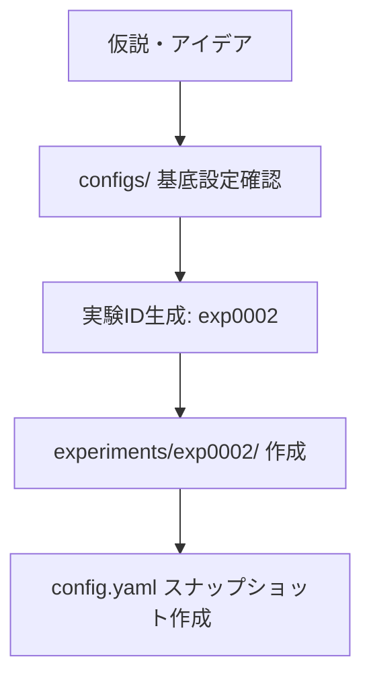

# 実験ワークフローガイド

## 🔄 実験ライフサイクル

### 1. 実験設計・計画



#### 1.1 新実験ディレクトリ作成

```bash
# 新実験ディレクトリ作成
mkdir experiments/exp0002
cp -r experiments/exp0001/{training.ipynb,evaluation.ipynb,inference.ipynb,env} experiments/exp0002/
```

#### 1.2 設定差分の決定

```yaml
# experiments/exp0002/config.yaml
# ベース設定から差分を定義
lgbm:
  params:
    learning_rate: 0.005  # 0.01 → 0.005
    num_leaves: 128       # 64 → 128
    # 他の設定は継承
```

### 2. データ準備・CV分割固定

```python
# CV分割を作成・固定
python -m scripts.make_folds \
  --config configs/cv.yaml \
  --data data/processed/train_processed.parquet \
  --output experiments/exp0002/cv_folds.parquet
```

**重要ポイント**:
- CV分割は実験開始前に固定
- `split_id`で分割手法を識別
- 同一分割での横比較を保証

### 3. 学習実行（training.ipynb）

#### 3.1 初期セットアップ

```python
# W&B初期化
run = wandb.init(
    project="titanic-lgbm",
    name=cfg['experiment']['id'],
    config=cfg,
    tags=['hyperopt', 'lr_0.005'],
    job_type="train"
)

# Git SHA記録
git_sha = get_git_sha()
```

#### 3.2 学習ループ

```python
for fold, (train_idx, valid_idx) in enumerate(cv_splits):
    # モデル学習
    model = lgb.train(cfg['lgbm']['params'], train_data, valid_data)
    
    # OOF蓄積
    oof_predictions[valid_idx] = model.predict(X_valid)
    
    # モデル保存
    model.save_model(f"model/fold{fold}.lgb")
    
    # W&B logging
    wandb.log({f'fold_{fold}_auc': fold_score})
```

#### 3.3 成果物保存

- `oof.parquet`: OOF予測
- `metrics.json`: CV指標
- `model/fold*.lgb`: 学習済みモデル
- `feature_list.txt`: 使用特徴量
- `wandb_run.txt`: W&B URL
- `git_sha.txt`: Git commit SHA

### 4. OOF分析（evaluation.ipynb）

#### 4.1 基本分析

```python
# CV性能確認
cv_auc = np.mean(fold_scores)
oof_auc = roc_auc_score(y_true, oof_pred)

print(f"CV AUC: {cv_auc:.6f}")
print(f"OOF AUC: {oof_auc:.6f}")
```

#### 4.2 品質チェック（リーク監査）

```python
# Fold間スコア分散チェック
fold_std = np.std(fold_scores)
if fold_std > 0.02:
    print("⚠️ Fold間スコア分散が大きい（リーク疑い）")

# Target分布均一性チェック
target_rates = [fold_target_rate(fold) for fold in folds]
if np.std(target_rates) > 0.05:
    print("⚠️ Fold間target分布が不均一")
```

#### 4.3 CV vs LB相関監視

```python
# 実験台帳から相関分析
experiments_df = pd.read_csv("experiments.csv")
plot_cv_lb_correlation(experiments_df)

# Trust Your CV の判定
correlation = calc_cv_lb_correlation()
if correlation < 0.7:
    print("⚠️ CV-LB相関が低い - CVスキーム見直し要")
```

### 5. 推論・提出（inference.ipynb）

#### 5.1 テストデータ予測

```python
# 学習済みモデル読み込み
models = [lgb.Booster(model_file=f"model/fold{i}.lgb") for i in range(5)]

# アンサンブル予測
test_pred = np.mean([model.predict(X_test) for model in models], axis=0)

# 閾値最適化（OOFベース）
optimal_threshold = optimize_threshold(oof_df)
binary_pred = (test_pred > optimal_threshold).astype(int)
```

#### 5.2 Kaggle提出

```python
# 提出ファイル作成
submission = create_submission(test_pred, binary_pred)

# Kaggle API提出
kaggle_submit(submission, message=f"exp0002 {git_sha}")

# Submission情報取得
submission_info = get_latest_submission()
```

#### 5.3 提出トレーサビリティ

```python
# Submission manifest作成
manifest = {
    'exp_id': 'exp0002',
    'models': model_paths,
    'threshold': optimal_threshold,
    'kaggle_submission': submission_info,
    'git_sha': git_sha,
    'wandb_run': wandb_url
}
save_manifest(manifest)
```

### 6. 台帳更新・所感記録

#### 6.1 実験台帳自動追記

```python
experiment_row = {
    'exp_id': 'exp0002',
    'cv_mean': cv_auc,
    'cv_std': fold_std,
    'lb_public': submission_info['public_score'],
    'git_sha': git_sha,
    'wandb_url': wandb_url,
    'notes': 'learning_rate tuning'
}
append_experiments_csv(experiment_row)
```

#### 6.2 実験ノート記録

```markdown
# 実験ノート - exp0002

## 変更点
- learning_rate: 0.01 → 0.005
- num_leaves: 64 → 128

## 結果  
- CV AUC: 0.8756 ± 0.0055 (vs exp0001: 0.8732)
- LB Public: 0.87081 (vs exp0001: 0.87011)

## 所感
- 低学習率でスコア改善
- overfittingは軽減
- 次回: feature_fractionも調整

## 次のアクション
- [ ] Optuna最適化実行
- [ ] 新特徴量追加: Cabin deck
```

## 📋 実験チェックリスト

### 🔄 実験開始前

- [ ] 実験ID生成・ディレクトリ作成
- [ ] config.yaml差分設定
- [ ] cv_folds.parquet固定
- [ ] 仮説・変更点明確化

### ⚡ 学習中

- [ ] W&B初期化・設定同期
- [ ] Git SHA記録
- [ ] fold毎スコア監視
- [ ] early_stopping適用
- [ ] feature importance記録

### 📊 評価・分析

- [ ] OOF AUC確認
- [ ] fold間スコア分散チェック
- [ ] calibration curve確認
- [ ] 閾値最適化実行
- [ ] CV vs LB相関更新

### 🚀 提出・記録

- [ ] テストデータ予測
- [ ] Kaggle API提出
- [ ] submission manifest作成
- [ ] 実験台帳更新
- [ ] notes.md所感記録

### 🎯 次実験準備

- [ ] 結果考察・仮説立案
- [ ] 改善点整理
- [ ] 次実験アイデア明確化

## 🚨 実験失敗時の対応

### スコア悪化時

1. **ロールバック**
   ```bash
   git checkout <previous_good_commit>
   ```

2. **分析**
   - OOF vs CV乖離確認
   - feature importance変化確認
   - overfitting疑いチェック

3. **段階的変更**
   - 1つずつパラメータ変更
   - ablation studyで原因特定

### リーク疑い時

1. **CV分割見直し**
   - GroupKFold検討
   - TimeSeriesSplit検討
   - Stratification軸変更

2. **特徴量監査**
   - future leak検出
   - target leak検出
   - test set dependence確認

### 時間不足時

1. **優先順位設定**
   - 高impact低effortタスク選択
   - early stoppingで高速化
   - サンプリングで検証

2. **並列実行**
   - 複数実験同時実行
   - ハイパーパラメータ並列探索

## 💡 ベストプラクティス

### 実験設計

- **小さく始める**: 1変更1実験
- **仮説駆動**: なぜその変更か明確化
- **再現性**: 全設定をconfig.yamlに記録

### データ管理

- **CV固定**: 同一分割で横比較
- **DVC活用**: データバージョン管理
- **成果物保存**: OOF・モデル・メトリクス完全保存

### トラッキング

- **W&B活用**: リアルタイム監視・比較
- **Git管理**: コード変更履歴
- **台帳管理**: 実験横断比較

### チームワーク

- **命名規則**: exp{XXXX}統一
- **ドキュメント**: notes.md必須
- **共有**: 重要発見は即座にチーム共有